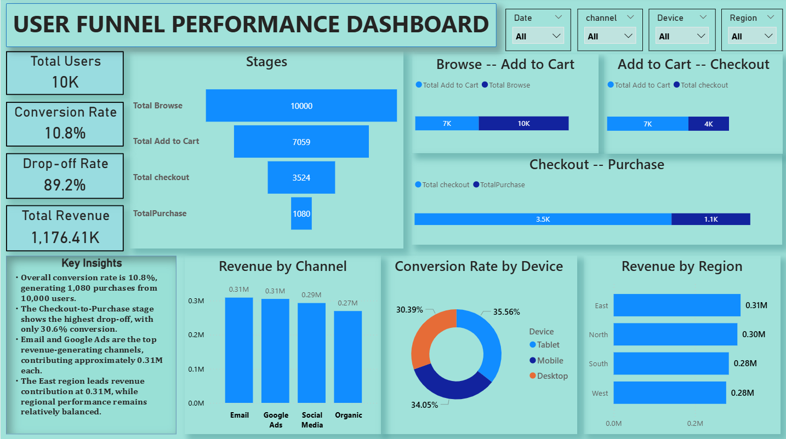

# User Funnel Performance Dashboard

## Project Overview
This Power BI dashboard analyzes user behavior across the sales funnel, from browsing to purchase. The objective is to identify conversion bottlenecks, understand user drop-off patterns, and optimize marketing and sales performance.

## Tools Used
- Power BI
- Power Query
- DAX
- Excel/CSV Dataset

## Key Metrics
- Total Users: 10,000
- Conversion Rate: 10.8%
- Drop-off Rate: 89.2%
- Total Revenue: 1.176M

## Dashboard Features
- Funnel Stage Analysis
- Browse-to-Cart Conversion Tracking
- Cart-to-Checkout Analysis
- Checkout-to-Purchase Analysis
- Revenue by Marketing Channel
- Conversion Rate by Device
- Revenue by Region
- Interactive Filters

## Dashboard Preview

## Key Insights
- Overall conversion rate is 10.8%, resulting in 1,080 purchases.
- The Checkout-to-Purchase stage shows the highest drop-off.
- Email and Google Ads are the top revenue-generating channels.
- East region generated the highest revenue contribution.
- Tablet users recorded the highest conversion rate among devices.

## Business Impact
- Identifies funnel bottlenecks.
- Improves conversion optimization strategies.
- Supports marketing channel performance analysis.
- Helps increase revenue through data-driven decisions.
